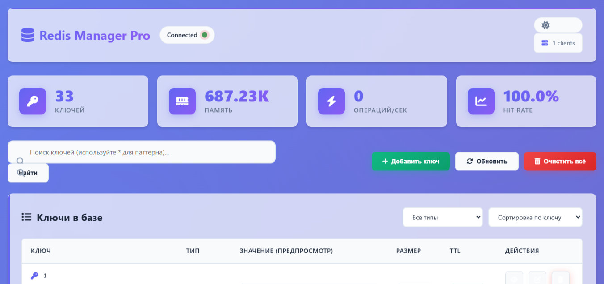
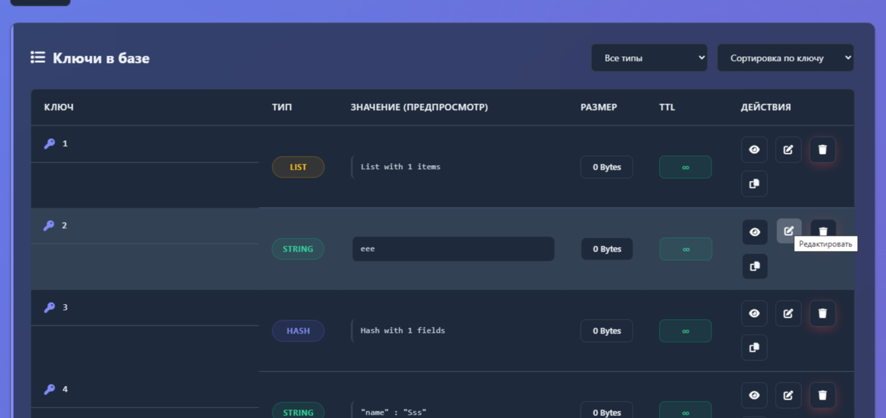
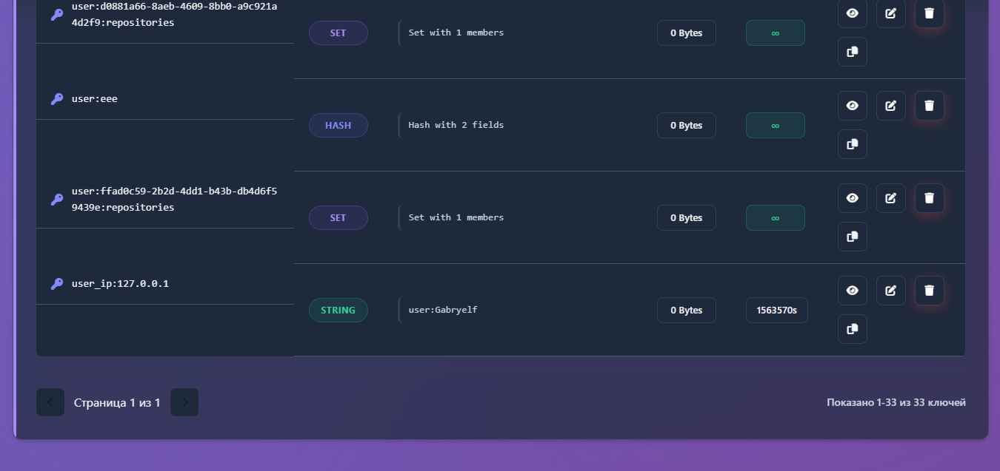
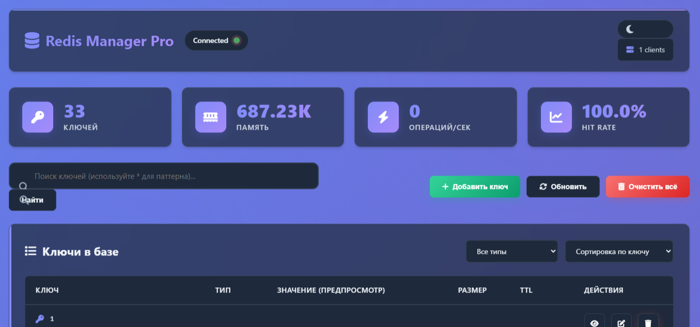
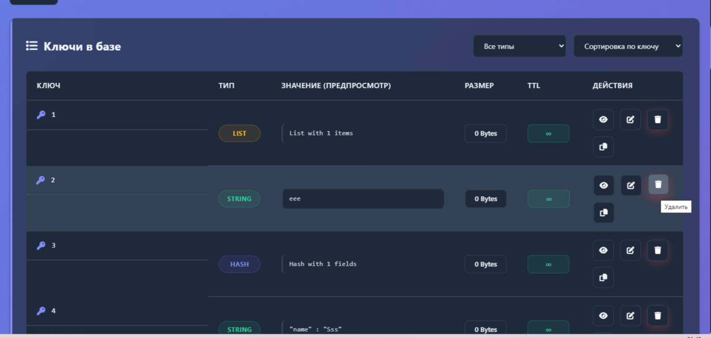

# Redis Manager Pro 📅

[](https://fastapi.tiangolo.com)
[](https://redis.io)
[](https://python.org)
[](https://developer.mozilla.org/js)
[](https://developer.mozilla.org/html)
[](https://developer.mozilla.org/css)

**Redis Manager Pro** — это современный веб-интерфейс для управления базами данных Redis с элегантным дизайном, темной темой и расширенной функциональностью.

## ✨ Особенности

- 🔍 **Поиск и фильтрация** — мощный поиск ключей по шаблонам
- 📊 **Детальная статистика** — мониторинг в реальном времени
- 🎨 **Современный UI** — темная/светлая тема с glassmorphism эффектами
- ⚡ **Быстрая работа** — асинхронные операции и live-обновления
- 🔄 **Управление ключами** — CRUD операции для всех типов данных Redis
- 📱 **Адаптивный дизайн** — полная поддержка мобильных устройств
- 🔒 **Безопасность** — защищенное подключение и валидация данных

## 🛠 Технологии

| Технология | Назначение | Версия |
|------------|------------|---------|
| **FastAPI** | Backend фреймворк | 0.104+ |
| **Redis** | База данных | 7.0+ |
| **Python** | Основной язык | 3.9+ |
| **Jinja2** | Шаблонизатор | 3.1+ |
| **JavaScript** | Frontend логика | ES6+ |
| **HTML5/CSS3** | Интерфейс | Modern |
| **SweetAlert2** | Модальные окна | 11.0+ |
| **Font Awesome** | Иконки | 6.4+ |

## 📸 Скриншоты

| Функция | Скриншот | Описание |
|---------|----------|----------|
| **Главная панель** |  | Обзор статистики и подключения |
| **Список ключей** |  | Таблица всех ключей с фильтрацией |
| **Просмотр ключа** |  | Детальная информация о ключе |
| **Добавление ключа** |  | Модальное окно создания ключа |
| **Темная тема** |  | Ночной режим интерфейса |
| **Удаление ключей** |  | Адаптивный дизайн |

## 🚀 Быстрый старт

### Предварительные требования

- Python 3.9 или выше
- Redis Server 7.0 или выше
- pip (менеджер пакетов Python)

### Установка

1. **Клонируйте репозиторий**
```bash
git clone https://github.com/yourusername/redis-manager-pro.git
cd redis-manager-pro
```

2. **Установите зависимости**
```bash
pip install -r requirements.txt
```

3. **Настройте переменные окружения** (опционально)
Создайте файл `.env`:
```env
REDIS_HOST=localhost
REDIS_PORT=6379
REDIS_DB=0
REDIS_PASSWORD=your_password_here
REDIS_SSL=false
```

4. **Запустите Redis (если не запущен)**
```bash
# Linux/Mac
redis-server

# Windows (используйте WSL или Redis для Windows)
redis-server.exe
```

5. **Запустите приложение**
```bash
uvicorn main:app --reload --host 127.0.0.1 --port 8000
```

6. **Откройте в браузере**
```
http://127.0.0.1:8000
```

## 📁 Структура проекта

```
redis-manager-pro/
├── main.py                 # Основное приложение FastAPI
├── redis_client.py         # Redis клиент и управление
├── config.py              # Конфигурация приложения
├── requirements.txt       # Зависимости Python
├── .env                  # Переменные окружения
├── static/              # Статические файлы
│   ├── style.css       # Основные стили
│   └── script.js       # JavaScript логика
├── templates/           # HTML шаблоны
│   └── index.html      # Главная страница
└── README.md           # Документация
```

## 🔧 Конфигурация Redis

### Параметры подключения
```python
# config.py
REDIS_HOST = "localhost"      # Хост Redis
REDIS_PORT = 6379            # Порт Redis
REDIS_DB = 0                 # Номер базы данных
REDIS_PASSWORD = None        # Пароль (если требуется)
REDIS_SSL = False           # Использовать SSL
```

### Поддерживаемые типы данных
- ✅ **String** — строковые значения
- ✅ **Hash** — хеш-таблицы
- ✅ **List** — списки
- ✅ **Set** — множества
- ✅ **Sorted Set** — упорядоченные множества
- ✅ **Stream** — потоки (базовое чтение)

## 🎯 Ключевые функции

### 1. **Управление ключами**
- Поиск по шаблонам (используйте `*` для поиска)
- Фильтрация по типу данных
- Сортировка по ключу, типу, размеру, TTL
- Просмотр, редактирование, удаление

### 2. **Статистика в реальном времени**
- Количество ключей в базе
- Использование памяти
- Количество подключений
- Hit rate кэша
- Операций в секунду

### 3. **Удобный интерфейс**
- Пагинация (50 ключей на страницу)
- Быстрое копирование ключей
- Автообновление данных каждые 5 секунд
- Уведомления о действиях

### 4. **Безопасность**
- Подтверждение удаления ключей
- Валидация ввода данных
- Защита от XSS атак
- Безопасное подключение к Redis

## 💡 Использование

### Поиск ключей
Используйте паттерны Redis:
- `*` — все ключи
- `user:*` — ключи начинающиеся с `user:`
- `*:cache` — ключи заканчивающиеся на `:cache`

### Работа с TTL
- `-1` — бесконечный TTL
- `0` — немедленное удаление
- `>0` — время жизни в секундах

### Форматы данных
- **String**: Любой текст или JSON
- **Hash**: JSON объект `{"field": "value"}`
- **List/Set**: JSON массив `["item1", "item2"]`

## 💻 API Endpoints

| Метод | Endpoint | Описание |
|-------|----------|----------|
| `GET` | `/` | Главная страница |
| `GET` | `/api/stats` | Статистика Redis |
| `GET` | `/api/search?pattern=*` | Поиск ключей |
| `GET` | `/key/{key}` | Детали ключа |
| `POST` | `/set/` | Создать/обновить ключ |
| `POST` | `/delete/{key}` | Удалить ключ |
| `POST` | `/flush/` | Очистить базу данных |
| `GET` | `/api/test-connection` | Проверка подключения |

## 💾 Отладка и логи

Приложение пишет логи в консоль:

```bash
# Уровни логирования
DEBUG: Получено ключей: 32
DEBUG: Первый ключ: {'key': 'test', 'type': 'string'}
INFO: 127.0.0.1:54321 - "GET /api/stats HTTP/1.1" 200 OK
```

Для включения детального логирования:
```bash
uvicorn main:app --reload --log-level debug
```

## 🔄 Развертывание

### Docker (рекомендуется)
```dockerfile
FROM python:3.9-slim

WORKDIR /app
COPY requirements.txt .
RUN pip install --no-cache-dir -r requirements.txt

COPY . .
CMD ["uvicorn", "main:app", "--host", "0.0.0.0", "--port", "8000"]
```

### Nginx прокси
```nginx
server {
    listen 80;
    server_name redis-manager.example.com;
    
    location / {
        proxy_pass http://127.0.0.1:8000;
        proxy_set_header Host $host;
        proxy_set_header X-Real-IP $remote_addr;
    }
}
```

## 🚀 Производительность

- ⚡ **Асинхронная обработка** — не блокирующие операции
- 🎯 **Кэширование** — минимизация запросов к Redis
- 📦 **Пагинация** — загрузка данных частями
- 🔄 **Live обновление** — обновление без перезагрузки страницы

## 🤝 Вклад в проект

1. Форкните репозиторий
2. Создайте ветку для фичи (`git checkout -b feature/amazing-feature`)
3. Зафиксируйте изменения (`git commit -m 'Add amazing feature'`)
4. Запушьте ветку (`git push origin feature/amazing-feature`)
5. Откройте Pull Request

## 📝 Лицензия

Этот проект распространяется под лицензией MIT. См. файл `LICENSE` для подробностей.

## 👨‍💻 Автор

**Redis Manager Pro** разработан и поддерживается сообществом.

[](https://github.com/TopCollegeTCF)
[](https://github.com/Gabryelf)

## 🌟 Поддержка проекта

Если проект был полезен, поставьте звезду ⭐ на GitHub!

---

**Redis Manager Pro** — мощный инструмент для разработчиков, работающих с Redis. 🚀

*"Простота в управлении, мощь Redis"*
